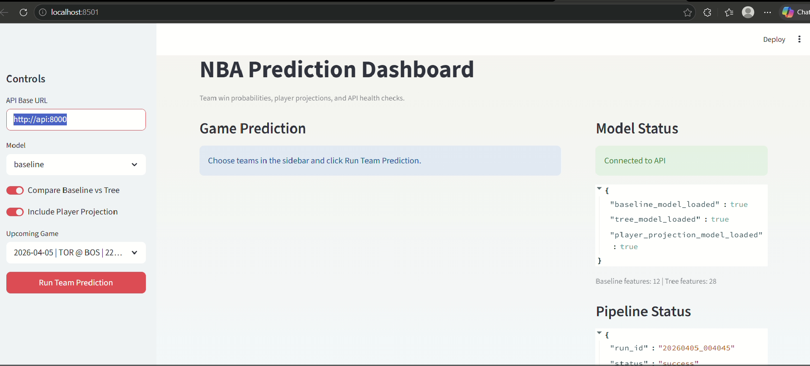
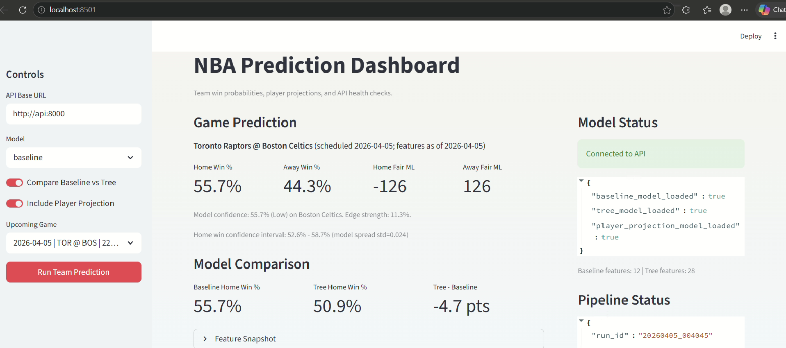
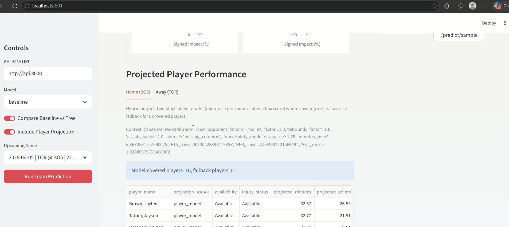
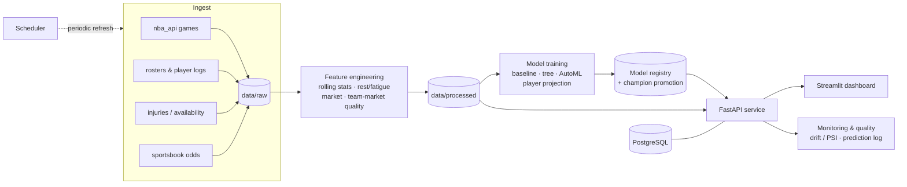

<div align="center">


# 🏀 NBA Prediction Engine

An end-to-end machine-learning platform that ingests NBA data, engineers leakage-safe features, trains multiple win-probability and player-projection models, and serves predictions through a **FastAPI** service and an interactive **Streamlit** dashboard — fully orchestrated with **Docker**.

[](https://www.python.org/)
[](https://fastapi.tiangolo.com/)
[](https://streamlit.io/)
[](https://docs.docker.com/compose/)
[](https://www.postgresql.org/)
[](#-models)

</div>

---

## 📘 Overview

This repository is a production-shaped NBA prediction engine. It is intentionally structured as a real ML product — from **data ingestion → feature engineering → model training → a served API → a dashboard**, with monitoring, a model registry, and champion-model promotion along the way.

What it does today:

- **Ingests** raw NBA games, current-season rosters, player game logs, injuries/availability, and sportsbook odds.
- **Engineers** leakage-safe rolling team stats, rest / back-to-back / fatigue features, market-odds features, and a custom **team-market quality** rating.
- **Trains** several team win-probability models (baseline, tree, AutoML challenger) plus a dedicated player-projection model.
- **Serves** normalized home/away win probabilities, fair moneylines, per-feature explanations, and availability-adjusted player projections via FastAPI.
- **Visualizes** everything in a Streamlit dashboard with live API health, monitoring/drift, and prediction-quality panels.

> ⚠️ **Data & models are generated, not committed.** The `data/`, `models/`, and `reports/` directories are produced by the pipeline scripts (which pull from the external NBA API and other sources) and are gitignored due to size. A fresh checkout serves the API/UI shell immediately; prediction endpoints become fully populated after you run the pipeline.

---

## 🎬 Demo

Pick an upcoming game and model in the sidebar, then **Run Team Prediction**. The dashboard connects to the FastAPI backend and returns a normalized win-probability report, a baseline-vs-tree model comparison, fair moneylines, per-feature explanations, and availability-adjusted player projections.

<div align="center">
  
  <br/><sub>Dashboard connected to the API — baseline, tree, and player-projection models loaded, with live pipeline status.</sub>
  <br/><br/>
  
  <br/><sub>Team win-probability report (home/away %, fair moneylines, confidence interval) with a baseline-vs-tree model comparison.</sub>
  <br/><br/>
  
  <br/><sub>Two-stage player projections (minutes → per-minute rates → box score), availability-adjusted per player.</sub>
</div>

---

## 🧠 Pipeline



### Features

- **Leakage-safe rolling stats** — points/rebounds/assists form computed strictly from prior games.
- **Rest & fatigue** — rest days, back-to-back flags, travel/timezone context, and a fatigue index.
- **Availability** — injury severity and out/questionable/probable status folded into team and player projections.
- **Market features** — sportsbook odds → implied team totals and market signals, with backtesting utilities.
- **Team / venue context** — rest, travel distance, timezone shift, and fatigue derived from schedule geography.

### Models

| Model | Type | Purpose |
| --- | --- | --- |
| Baseline | Logistic regression (scaled) | Interpretable team win probability + linear feature contributions |
| Tree | XGBoost | Non-linear win probability + SHAP-style contributions |
| AutoML challenger | Small bake-off (logreg / RF / XGB) | Metric-driven challenger for champion promotion |
| Player projection | Two-stage (minutes → per-minute rates) | Availability-adjusted points/rebounds/assists with confidence bands |

### Results

Holdout metrics below were produced by running the real feature + training scripts on an **offline synthetic NBA-like schedule** (live `stats.nba.com` timed out in this environment). Evaluation is **game-level** (one row per `GAME_ID`, home perspective). Re-run after a successful live ingest to replace these with season-true numbers.

| Model | Accuracy | Log Loss | Brier | ROC-AUC |
| --- | :---: | :---: | :---: | :---: |
| Baseline (logistic) | 0.566 | 0.687 | 0.247 | 0.590 |
| Tree (XGBoost) | 0.559 | 1.032 | 0.316 | 0.586 |
| Champion (AutoML → logreg_l2) | 0.604 | 0.669 | 0.238 | 0.613 |

Notes from this run:
- Champion promotion selected **AutoML challenger** (`logreg_l2`) over baseline/tree using the weighted log-loss/Brier score.
- Default XGBoost without tuning underperformed on probabilistic metrics here — a useful interview talking point about calibration vs raw accuracy.
- Source registry entries: `models/registry/*` (generated locally; gitignored).

---

## 🚀 How to Run / Install

### Option 1 — Docker (recommended)

Brings up the full stack (PostgreSQL, API, scheduler, and dashboard) in one synchronized environment.

```bash
git clone https://github.com/KhaNguyen-Q/nba-prediction-engine
cd nba-prediction-engine
docker-compose up --build
```

- **Dashboard:** http://localhost:8501
- **API docs:** http://localhost:8000/docs

### Option 2 — Local Python

```bash
pip install -r requirements.txt          # xgboost included — first install can take a bit

python scripts/update_pipeline.py        # ingest → features → train (needs network for NBA data)

uvicorn api.main:app --host 0.0.0.0 --port 8000     # terminal 1
streamlit run streamlit_app.py                      # terminal 2
```

Set the sidebar **API Base URL** to `http://127.0.0.1:8000` when running locally. To boot the API before any models/data exist (shell only), set `STRICT_STARTUP_CHECKS=0`.

---

## 📁 Folder Structure

```
nba-prediction-engine/
├─ api/                 # FastAPI service — win-probability & player-projection endpoints
│  └─ main.py
├─ scripts/             # Ingestion, feature engineering, training, monitoring, utilities
│  ├─ update_pipeline.py        # Orchestrates ingest → features → train
│  ├─ get_data.py / fetch_*.py  # Data ingestion (games, players, injuries, odds, schedule)
│  ├─ build_features.py         # Leakage-safe feature engineering
│  ├─ build_inference_features.py
│  ├─ train_baseline.py / train_tree_model.py / train_automl_challenger.py
│  ├─ train_player_model.py
│  ├─ model_utils.py / model_promotion.py   # Registry & champion promotion
│  ├─ generate_monitoring_report.py         # Freshness + drift (PSI)
│  ├─ generate_prediction_quality_report.py # Logged-prediction quality
│  └─ smoke_test.py
├─ config/             # Canonical NBA team metadata & static config
├─ streamlit_app.py    # Streamlit dashboard
├─ docker-compose.yml  # api + scheduler + streamlit + postgres
├─ Dockerfile
├─ requirements.txt
├─ data/               # (generated) raw & processed datasets — gitignored
├─ models/             # (generated) trained artifacts & registry — gitignored
└─ reports/            # (generated) monitoring & quality reports — gitignored
```

See [`CONTRIBUTING.md`](CONTRIBUTING.md) for the documented step-by-step pipeline flows.

---

## 💡 Lessons Learned

- **Leakage safety is a feature, not an afterthought.** Rolling stats and labels are computed strictly from past games so validation reflects real forecasting.
- **Separate the shell from the data.** Keeping generated `data/`/`models/` out of the repo — and letting the API boot in a degraded-but-honest state — makes the project easy to clone and reason about.
- **Explainability builds trust.** Linear contributions (baseline) and tree contributions (XGBoost) turn a probability into an inspectable decision.
- **Operate the model, don't just train it.** A registry, champion promotion, drift/PSI monitoring, and a prediction log turn a notebook model into a maintainable service.
- **Cut unfinished experiments.** Half-wired LSTM/ensemble stubs and speculative features were removed rather than left as fake production surface area.

---

## 🔭 Future Improvements (interview-friendly roadmap)

These are intentional next steps — not unfinished leftovers in the serve path:

- **Pregame odds snapshots** with a hard point-in-time cutoff (no post-tip market leakage).
- **Wire Postgres** for prediction logs, registry metadata, and eventually a feature store (Compose already provisions it).
- **Production stacking ensemble** (register + serve + game-level eval) once baseline/tree are stable.
- **Sequence / deep models** only with holdout metrics, registry entries, and API integration — not experimental-only scripts.
- Calibrated probability outputs and richer walk-forward backtesting.
- CI that runs `scripts/smoke_test.py` and publishes the results table automatically.
- Managed deployment (container registry + hosted Postgres) and scheduled retraining.
- Optional LLM matchup summaries on top of `/predict/team` outputs (DSN-aligned educational layer).

---

<div align="center"><sub>FastAPI · Streamlit · scikit-learn · XGBoost · PostgreSQL · Docker</sub></div>
